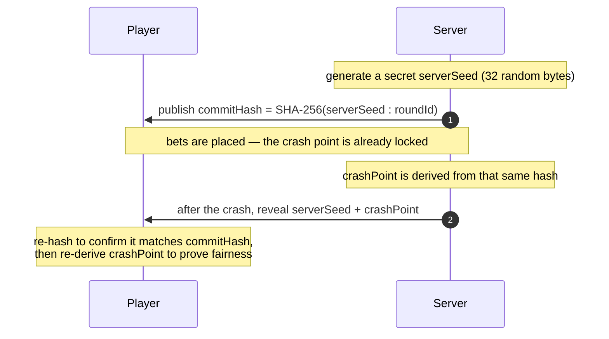
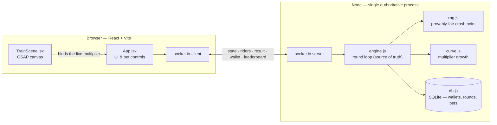

#  Trainiator

**A provably-fair, real-time multiplayer crash game — with an authoritative server, a verifiable RNG, and a hand-built pixel Art-Deco world.**


> **▶ Live demo:** _add your deploy URL here_
> **📹 Demo clip:** drop a ~6-second recording at `docs/demo.gif` — the train accelerating into the warp-blur past 7×, then jackknifing off the rails. It's the most striking six seconds of the project; then swap this line for ``.

> ⚠️ **Fake currency only.** No real money, payments, or financial transactions anywhere. This is a portfolio piece and technical demonstration.

---

## Why this project is interesting

- **The server is the single source of truth.** One authoritative game loop owns the clock and decides every bet, cash-out, and crash. The client only *renders* — it can't cheat the outcome.
- **The RNG is provably fair, and you can prove it in the browser.** A cryptographic commit/reveal scheme locks each crash point *before* bets and reveals the seed *after*, so anyone can re-derive the result and confirm it was never altered.
- **The house edge is honest math, not rug-pulls.** The margin is a smooth haircut on profit rather than fake instant crashes (details below).
- **Retention mechanics are quarantined from the RNG.** Streaks, near-miss flags, free bets, and variable pacing are cosmetic — none of them can reach the fairness code.
- **A distinctive, hand-built aesthetic.** A GSAP-driven pixel Art-Deco railway (parallax hills, rolling wheels, warp-speed zoom-blur, a derailment) and fully *procedural* Web Audio — no neon, no template.

---

## Provably fair

Trainiator uses a commit/reveal scheme so the crash point is fixed before anyone bets, and independently verifiable afterward.



Because SHA-256 is one-way, the published hash leaks nothing about the outcome — yet it commits the server to it. In the app, the **"✓ fair"** panel re-runs this entire derivation in your browser (`crypto.subtle`) and shows the **full seed and hash, click-to-copy**, so you can verify any round anywhere.

**The house edge lives in exactly one place** (`src/rng.js`) and is applied as a smooth haircut on *profit* — never as surprise 1.00× "rug pulls". The full derivation of the crash distribution and the resulting return-to-player is below.

---

## The math behind it

Two independent pieces of math drive the game: **where** the train derails (the crash-point distribution, `src/rng.js`) and **how fast** the multiplier climbs to get there (the growth curve, `src/curve.js`). They're kept separate on purpose — the crash point is committed up front and never depends on the animation.


### 1 · A uniform draw from the hash

The round's SHA-256 commitment doubles as the entropy source. Its first 13 hex characters (52 bits) are read as an integer and scaled to a uniform variable:

$$u \in [0, 1), \qquad u = \frac{\mathrm{int}_{16}\big(\text{hash}[0{:}13]\big)}{2^{52}}$$

(An optional `instantCrashRate` slice can be reserved for forced 1.00× crashes; it defaults to 0.)

### 2 · The fair, zero-edge curve

From $u$, the *fair* crash multiplier is

$$X = \frac{1}{1 - u}$$

the canonical crash distribution, whose survival function is clean:

$$P(X > x) = P\!\left(u > 1 - \tfrac{1}{x}\right) = \frac{1}{x}, \qquad x \ge 1$$

So the median is exactly **2×** (since $P(X > 2) = \tfrac{1}{2}$), with a heavy tail: $X$ exceeds 10× one time in ten, 100× one time in a hundred. It carries **zero** house edge — a bet cashed at $m$ wins with probability $1/m$ and pays $m$, for an expected return of exactly 1.

### 3 · The house edge — a haircut on profit

Instead of skimming with surprise instant crashes, the edge is a fixed haircut on the *profit* above 1×:

$$\text{crash} = 1 + \text{rtp}\,(X - 1), \qquad \text{rtp} = 0.94$$

The return-to-player at a cash-out target $m$ follows directly. You win iff the crash reaches $m$, i.e. $X \ge 1 + \tfrac{m-1}{\text{rtp}}$, so

$$P(\text{win at } m) = \frac{\text{rtp}}{\text{rtp} + m - 1}, \qquad \mathrm{RTP}(m) = m \cdot P(\text{win}) = \frac{m\,\text{rtp}}{\text{rtp} + m - 1}$$

Two properties fall out of this:

- **The house is never at a disadvantage:** $\mathrm{RTP}(m) \le 1$ for every $m \ge 1$ (equality only at $m = 1$).
- **The edge scales with ambition, smoothly** — ~0% right above 1×, **96.9%** at 2×, easing toward the floor of **94%** for high targets. No cliff, no rug-pull.

The result is floored to two decimals and clamped to $\ge 1.00$. That flooring *alone* yields an instant 1.00× crash about **1%** of the time — $P(\text{crash} < 1.01) = 1 - \tfrac{1}{1.0106} \approx 0.0105$ — matching real crash games with no special-casing.

### 4 · The growth curve

Given a committed crash point, the multiplier climbs **exponentially** from 1.00×:

$$m(t) = e^{k t}, \qquad k = 0.06$$

and the round ends at the exact instant the curve reaches the pre-committed crash point — the inverse of the climb:

$$t_{\text{crash}} = \frac{\ln(\text{crashPoint})}{k}$$

At $k = 0.06$ that's ≈ 11.6 s to 2×, 26.8 s to 5×, and 38.4 s to 10×. The live value is broadcast every 100 ms purely for the animation; the crash fires at $t_{\text{crash}}$ on the committed number, never on a sampled overshoot.

---

## Architecture

A monolith by design: one Node process runs the HTTP server, the WebSocket server, and the authoritative game loop; the built React SPA is served from the **same origin** (so there's no CORS and WSS is free behind the platform's TLS).



| Module | Responsibility |
|--------|----------------|
| `server.js` | Express + Socket.IO wiring, presence, per-socket rate limiting, leaderboard broadcast, token-gated admin, health check, hardening. |
| `src/engine.js` | The authoritative loop: `betting → running → crashed`. Owns the clock; decides valid bets, auto-cash-outs, and settlement. Crash-safe (one bad round can't freeze the loop). |
| `src/rng.js` | The *only* place outcomes are decided. Seed generation, the SHA-256 commitment, and the crash-point curve with the RTP edge. |
| `src/curve.js` | Multiplier growth over time and the time-to-crash inverse. |
| `src/db.js` | Persistence via built-in `node:sqlite` — wallets, rounds, bets, sessions, leaderboard. |
| `src/retention.js` | Cosmetic-only streaks / free bets. Never touches the RNG. |
| `web/` | React + Vite SPA: canvas scene, live rider list, achievements, in-browser fairness verifier. |

---

## Tech stack & rationale

| Layer | Choice | Why |
|-------|--------|-----|
| Runtime | **Node 22, single process** | The game loop must own one clock — one process is one source of truth. (Horizontal scale is a documented non-goal; see the ADR.) |
| Realtime | **Socket.IO** | Broadcast/rooms, auto-reconnect, and WS-with-fallback out of the box. |
| Persistence | **`node:sqlite`** (built-in) | Zero-dependency, synchronous, single-writer — ideal for one process. Swap to `better-sqlite3`/Postgres if it outgrows a demo. |
| Fairness | **Node `crypto` (SHA-256)** | Commit/reveal needs nothing more, and it's verifiable in any language. |
| Frontend | **React 18 + Vite** | Fast HMR, small production bundle. |
| Scene | **GSAP + Canvas 2D** | A single 60 fps ticker; the live multiplier drives scroll speed, wheel roll, smoke, and the warp-blur. |
| UI motion | **Motion (Framer)** | Declarative enter/exit for toasts, modals, and history pills. |
| Audio | **Web Audio API (procedural)** | Engine chug, whistle, and derailment are synthesized at runtime — no audio files to ship. |

---

## Key engineering decisions

- **Authoritative server, untrusted client.** Every outcome is computed server-side and pushed; the browser renders and requests, but never decides. This is what makes the fairness guarantee meaningful.
- **One shared round for everyone.** A single loop broadcasts one game to all connected players (live rider field, presence, leaderboard) — real multiplayer, not per-tab simulations.
- **Fairness code is a sealed unit.** All of Part-2's retention/pacing lives outside `rng.js`; the RNG is pure and deterministic given `(seed, roundId, config)`.
- **Same-origin serving.** Express serves `web/dist` and the socket on one origin → no CORS, WSS behind the host's TLS, and `git push` redeploys the whole thing.
- **Hardened for public exposure.** Locked CORS, security headers, socket frame cap, crash-safe loop, and process handlers. See [`docs/production-readiness.md`](docs/production-readiness.md) for the full deploy/scale ADR.

---

## Running locally

**Prerequisites:** Node ≥ 22.5 (for `node:sqlite`) and npm.

```bash
# 1. install
npm install
cd web && npm install && cd ..

# 2a. dev — two processes, Vite proxies the socket to the server
npm run server          # http://localhost:3000
cd web && npm run dev   # http://localhost:5173  (proxies /socket.io -> :3000)

# 2b. or run the production shape locally
npm run build           # builds web/dist  (stop the Vite dev server first on Windows)
npm start               # server serves the built SPA on :3000
```

Run the test suite (Node's built-in runner):

```bash
npm test
```

---

## Project structure

```
server.js                  Express + Socket.IO + game wiring, hardening, admin
src/
  engine.js                authoritative round loop
  rng.js                   provably-fair crash point + house edge
  curve.js                 multiplier growth / time-to-crash
  db.js                    node:sqlite persistence
  retention.js             cosmetic streaks & free bets (never touches RNG)
  sim.js                   RTP simulation harness
test/                      unit tests (rng, curve, engine, wallet, retention)
web/
  src/
    App.jsx                UI, bet flow, achievements, fairness verifier
    TrainScene.jsx         GSAP canvas railway scene
    LiveBets.jsx           live rider field / your bet history
    sound.js               procedural Web Audio
    achievements.js        client-side cosmetic achievements
docs/production-readiness.md   deployment & scaling ADR
Dockerfile                 multi-stage production build
```

---

## Deployment

Ships as a **single containerized Node process** on a persistent-process host (Fly.io / Render / Railway), serving the built frontend and the socket from one origin, with SQLite on a small persistent volume. The multi-stage [`Dockerfile`](Dockerfile) builds the SPA and runs the server with prod-only dependencies. Full rationale, trade-offs, and the (out-of-scope) horizontal-scaling path are in the [production-readiness ADR](docs/production-readiness.md).

---

## Disclaimer

Trainiator is a **technical demonstration using fake currency only**. There is no real money, no payments, no accounts, and no financial transactions of any kind.
